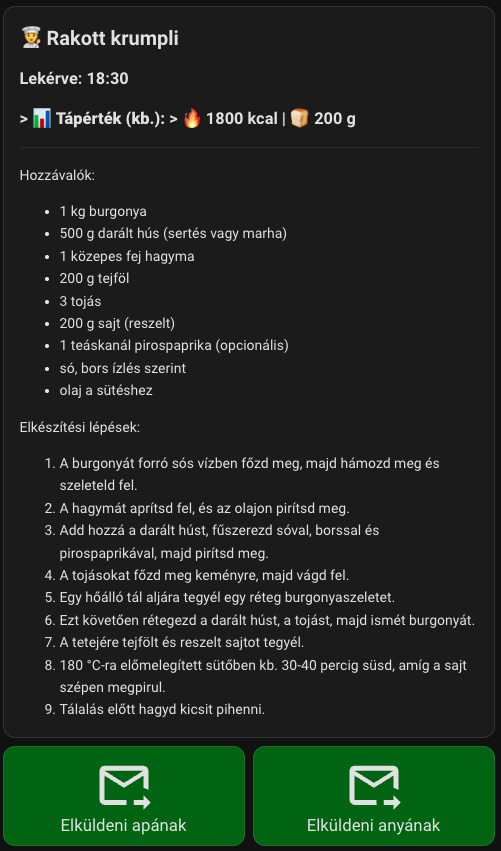
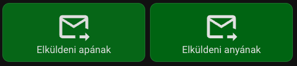

# What should I cook today with HA and OpenAI

### What should I cook today? Displaying AI-generated recipes on the UI. Like it? Send it via email!

### Important notes: I am Hungarian. The images show settings and results in Hungarian. ###

A guaranteed Wife Acceptance Factor for Home Assistant :smile:

We've had OpenAI integrated into our HA for a while now. I try to encourage the family to use it and ask questions. I also told my wife that if she has no idea what to cook, she should ask the AI for a good recipe. So far, so good. The AI tells you the recipe, and it can even repeat it, but it sucks to keep asking if you forget an ingredient. I wanted to find a way to display the recipe on a specific part of the dashboard. This way, the last requested recipe can be checked anytime while cooking. 

To achieve this, we will use a trigger-based Template Sensor. Its huge advantage is that it can store text of practically any length.

### And here are the ingredients: ### 

### 1. The Prompt for OpenAI ###

Copy this text into the prompt/instructions field of your OpenAI Conversation integration:

#### When the user asks for a food recipe, generate the complete recipe including ingredients and step-by-step instructions. You MUST use the available tool/script named 'Show recipe on ui' to pass the dish's name to 'recipe_name', the full text to 'recipe_text', and estimate the approximate calories (kcal) and carbohydrates (g) for the whole meal, passing them to the 'calories' and 'carbs' fields. ####

If you want, you can also add this to prevent the AI from talking too much: 
#### Important: Do NOT read the full recipe out loud. Verbally, you must reply ONLY with this short confirmation: "I have displayed the requested recipe on your screen." ####

This is what it looks like for me:


### 2. Creating the Script ### 

This is what OpenAI will call. The script simply receives the text and sends it as an event into the Home Assistant system, which will then be caught by the sensor. Don't forget to check this script in the "Exposed entities/tools" list of your OpenAI agent!

```yaml
alias: Show recipe on ui
description: This is called by OpenAI to pass the recipe and nutrition info.
sequence:
  - event: update_recipe_display
    event_data:
      recipe_name: "{{ recipe_name }}"
      recipe_content: "{{ recipe_text }}"
      calories: "{{ calories }}"
      carbs: "{{ carbs }}"
mode: single
fields:
  recipe_name:
    selector:
      text: {}
    name: Recipe Name
  recipe_text:
    selector:
      text:
        multiline: true
    name: Recipe text
  calories:
    selector:
      text: {}
    name: Calories
    description: "e.g., 1200 kcal"
  carbs:
    selector:
      text: {}
    name: Carbohydrates
    description: "e.g., 150 g"
```

### 3. Creating the Template Sensor (configuration.yaml) ###

You need to copy this code into your Home Assistant's configuration.yaml file. This creates the sensor that listens for the specific event and stores the long recipe in its attributes. (Don't forget to restart Home Assistant after making the change!)

```yaml
template:
  - trigger:
      - trigger: event
        event_type: update_recipe_display
    sensor:
      - name: "Kitchen Recipe"
        unique_id: kitchen_recipe_storage
        state: "{{ now().strftime('%H:%M') }}" 
        attributes:
          recipe_name: "{{ trigger.event.data.recipe_name }}"
          recipe_text: "{{ trigger.event.data.recipe_content }}"
          calories: "{{ trigger.event.data.calories }}"
          carbs: "{{ trigger.event.data.carbs }}"
```

### 4. The Dashboard Card (Lovelace UI) ###

Put a Markdown card on the dashboard of your kitchen tablet/phone. This card reads the sensor's attributes and displays the text.

```yaml
type: markdown
content: >-
  ## 👨‍🍳 {{ state_attr('sensor.kitchen_recipe', 'recipe_name') | default('New recipe', true) }}

  > **📊 Nutrition (approx.):** > 🔥 {{ state_attr('sensor.kitchen_recipe', 'calories') | default('?', true) }} | 🍞 {{ state_attr('sensor.kitchen_recipe', 'carbs') | default('?', true) }} 

  ---

  {{ state_attr('sensor.kitchen_recipe', 'recipe_text') | default('No recipe to display yet.', true) }}
```

### How does it work? ### 

When you ask for a recipe, OpenAI calls the Show recipe on ui script. The script triggers an internal event named update_recipe_display with the recipe text. The Template Sensor immediately notices this and saves the text, and the Markdown card on the dashboard updates instantly. It's stable, native, and requires no external add-ons!

### And the result on my phone: ### 

 

##  Displaying on a tablet (Fully Kiosk): ##

This automation turns on the screen when a recipe arrives (mine usually turns off automatically) and switches to the lovelace-tablet/whatshouldIcooktoday view, where it displays the Markdown card described in step 4.

### IMPORTANT: You must replace the device_id, entity_id, and the URL with your own device's details! ### 

```yaml
alias: "Kitchen Tablet: Switch to recipe view"
description: Automatically switches to the recipe dashboard when a new recipe arrives.
triggers:
  - trigger: event
    event_type: update_recipe_display
actions:
  - type: turn_on
    device_id: 683bee5a4c990541d620d1ac308a664d
    entity_id: 81ab42e08499ee044332a48b8308f896
    domain: switch
  - action: fully_kiosk.load_url
    metadata: {}
    data:
      device_id: 683bee5a4c990541d620d1ac308a664d
      url: http://192.168.24.90:8123/lovelace-tablet/whatshouldIcooktoday
mode: single
```

## Like the recipe? Send it to yourself via email! ##

### Step 1: Setting up the Email Sender (SMTP) in configuration.yaml ### 

If you haven't sent emails from Home Assistant yet, you need to set up a sender account in your configuration.yaml file. For example, using Gmail.

#### Important: For Gmail, you need to generate an "App Password" in your Google account security settings; your regular password won't work! ####

Copy this into your configuration.yaml and restart HA:

```yaml
notify:
  - name: "recipe_sender"
    platform: smtp
    server: "smtp.gmail.com"
    port: 587
    timeout: 15
    sender: "your.email@gmail.com"
    encryption: starttls
    username: "your.email@gmail.com"
    password: "your_generated_app_password_goes_here"
    recipient: "your.email@gmail.com" # The recipe will be sent here
    sender_name: "Kitchen Assistant"
```

### Step 2: Creating the Sending Script ### 

We need to create a script that reads the recipe from the sensor we created earlier and sends the email.

Create this script:

```yaml
alias: Send recipe by email
icon: mdi:email-send
sequence:
  - action: notify.recipe_sender
    data:
      title: "👨‍🍳 Recipe: {{ state_attr('sensor.kitchen_recipe', 'recipe_name') }}"
      message: |-
        Here is the requested recipe:
        
        📊 Nutrition Facts (Whole meal):
        🔥 Calories: {{ state_attr('sensor.kitchen_recipe', 'calories') | default('No data', true) }}
        🍞 Carbs: {{ state_attr('sensor.kitchen_recipe', 'carbs') | default('No data', true) }}
        
        -------------------------------------------
        
        {{ state_attr('sensor.kitchen_recipe', 'recipe_text') }}
mode: single
```

### Step 3: Adding the Button to the Dashboard ### 

Finally, go to the page where you display the recipe, edit the dashboard, and add a Button card right below your Markdown card (the recipe text). This button should call the script created above. I use two buttons so I can send it to two different addresses: (for father and mother) 



Peter
